# AWS Cloud & DevOps Portfolio Website

A production-style personal portfolio website built with React and deployed on AWS using a real CI/CD pipeline.

This project demonstrates how a static frontend application can be built, deployed, cached, secured, and automatically updated using AWS and GitHub Actions.

## Project Overview

This is my personal AWS Cloud and DevOps portfolio website. It showcases my cloud projects, AWS certification, technical skills, and hands-on deployment experience.

The goal of this project is not only to create a portfolio, but also to demonstrate a real-world deployment workflow using AWS services and CI/CD automation.

## Live Portfolio

**Portfolio URL :** https://portfolio.rifkhan.xyz/

## Repository

GitHub Repository: Add your GitHub repo URL here

## Architecture

```text
Developer
   |
   | Push code to GitHub
   v
GitHub Repository
   |
   | GitHub Actions CI/CD
   v
Build React App
   |
   | npm ci
   | npm run build
   v
AWS OIDC Authentication
   |
   | Assume IAM Role securely
   v
Amazon S3 Bucket
   |
   | Upload dist files
   v
Amazon CloudFront
   |
   | Cache invalidation
   v
ACM HTTPS Certificate
   |
   v
Route 53 Custom Domain
   |
   v
User Browser
```

## AWS Services Used

- Amazon S3
- Amazon CloudFront
- AWS Certificate Manager
- Amazon Route 53
- AWS IAM
- GitHub Actions OIDC
- AWS CLI

## DevOps Tools Used

- Git
- GitHub
- GitHub Actions
- Node.js
- NPM
- Vite
- React
- Tailwind CSS
- Framer Motion
- Lucide React

## Key Features

- Responsive React portfolio website
- Modern UI with animations
- AWS certification section
- Cloud and DevOps project showcase
- GitHub project links
- Contact section
- Static website deployment to S3
- CloudFront CDN distribution
- HTTPS enabled with ACM
- Custom domain using Route 53
- CI/CD pipeline using GitHub Actions
- Secure AWS authentication using OIDC
- Automatic CloudFront cache invalidation after deployment

## CI/CD Pipeline

The deployment is fully automated using GitHub Actions.

Whenever code is pushed to the main branch, the pipeline performs the following steps:

1. Checkout source code
2. Install Node.js
3. Install dependencies using `npm ci`
4. Build the production React app using `npm run build`
5. Authenticate to AWS using OIDC and IAM Role
6. Sync the `dist` folder to Amazon S3
7. Invalidate CloudFront cache
8. Updated portfolio becomes available through the live domain

## GitHub Actions Workflow

```yaml
name: Deploy Portfolio to AWS

on:
  push:
    branches:
      - main

permissions:
  id-token: write
  contents: read

jobs:
  deploy:
    name: Build and Deploy Portfolio
    runs-on: ubuntu-latest

    steps:
      - name: Checkout source code
        uses: actions/checkout@v4

      - name: Setup Node.js
        uses: actions/setup-node@v4
        with:
          node-version: 20

      - name: Install dependencies
        run: npm ci

      - name: Build React application
        run: npm run build

      - name: Configure AWS credentials using OIDC
        uses: aws-actions/configure-aws-credentials@v4
        with:
          role-to-assume: ${{ secrets.AWS_ROLE_ARN }}
          aws-region: ap-south-1

      - name: Deploy build files to S3
        run: aws s3 sync dist/ s3://YOUR_BUCKET_NAME --delete

      - name: Invalidate CloudFront cache
        run: |
          aws cloudfront create-invalidation \
            --distribution-id YOUR_DISTRIBUTION_ID \
            --paths "/*"
```

## Security Implementation

This project uses GitHub Actions OIDC instead of storing long-term AWS access keys in GitHub Secrets.

### Why OIDC?

- No AWS access key stored in GitHub
- Temporary credentials are generated during workflow execution
- More secure than IAM user access keys
- Follows AWS security best practices
- Uses IAM Role with limited permissions

## IAM Permissions Used

The GitHub Actions IAM Role was configured with least-privilege permissions for:

- Uploading files to the S3 portfolio bucket
- Deleting old S3 files during sync
- Creating CloudFront invalidations

Example permissions:

```json
{
  "Version": "2012-10-17",
  "Statement": [
    {
      "Sid": "AllowS3PortfolioDeployment",
      "Effect": "Allow",
      "Action": [
        "s3:PutObject",
        "s3:DeleteObject",
        "s3:GetObject",
        "s3:ListBucket"
      ],
      "Resource": [
        "arn:aws:s3:::YOUR_BUCKET_NAME",
        "arn:aws:s3:::YOUR_BUCKET_NAME/*"
      ]
    },
    {
      "Sid": "AllowCloudFrontInvalidation",
      "Effect": "Allow",
      "Action": ["cloudfront:CreateInvalidation"],
      "Resource": "*"
    }
  ]
}
```

## Project Structure

```text
aws-devops-portfolio/
│
├── public/
│   ├── favicon.svg
│   ├── icons.svg
│   └── profile.jpeg
│
├── src/
│   ├── App.jsx
│   ├── index.css
│   └── main.jsx
│
├── .github/
│   └── workflows/
│       └── deploy.yml
│
├── package.json
├── tailwind.config.js
├── postcss.config.js
├── vite.config.js
└── README.md
```

## Portfolio Photos

### Portfolio Home Page

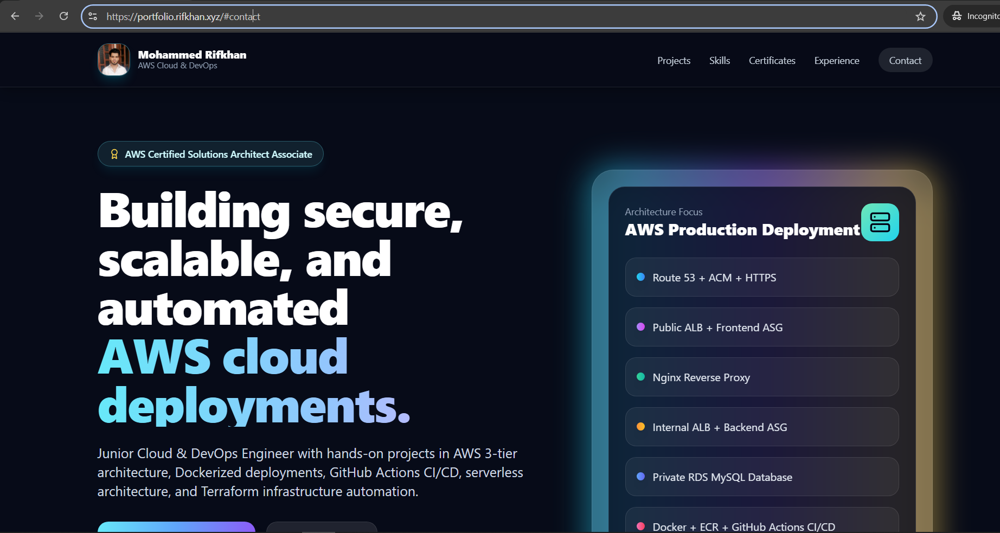

### Projects Section

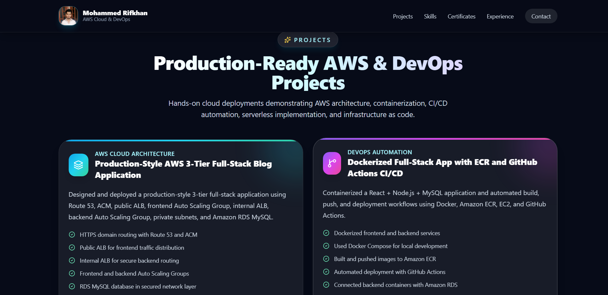
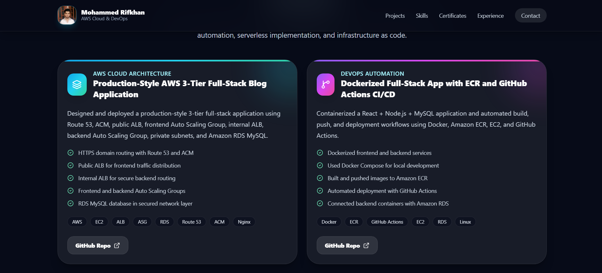
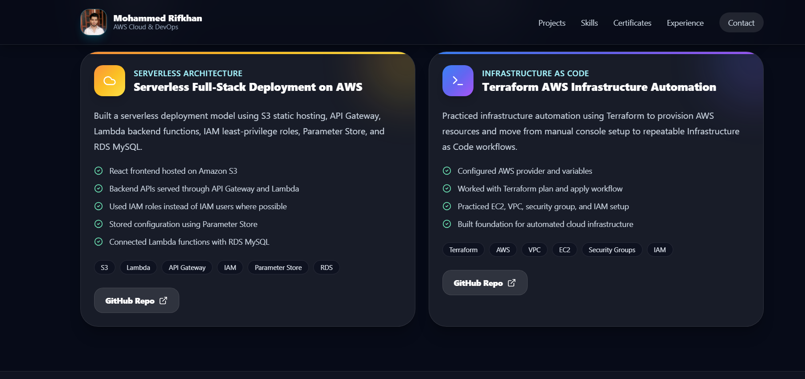

### Certificates Section

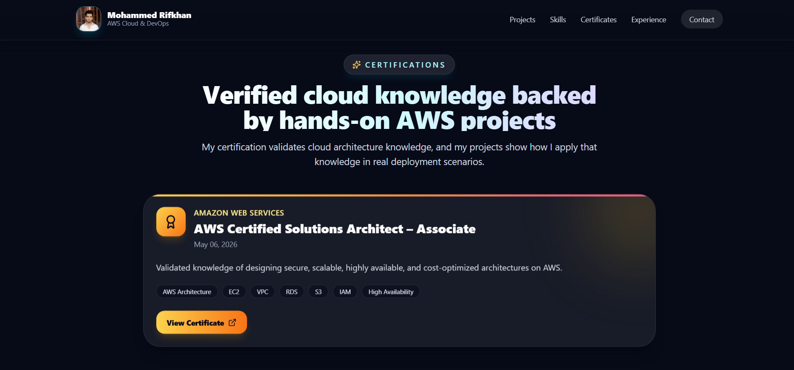

### Experience Section

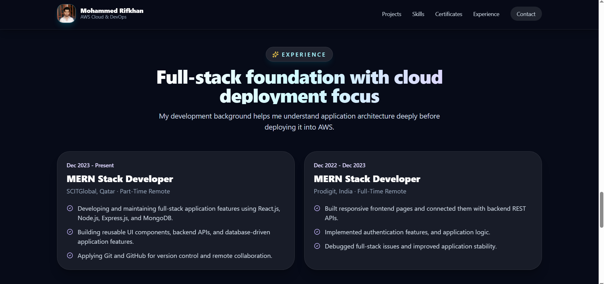

### GitHub Actions Successful Deployment

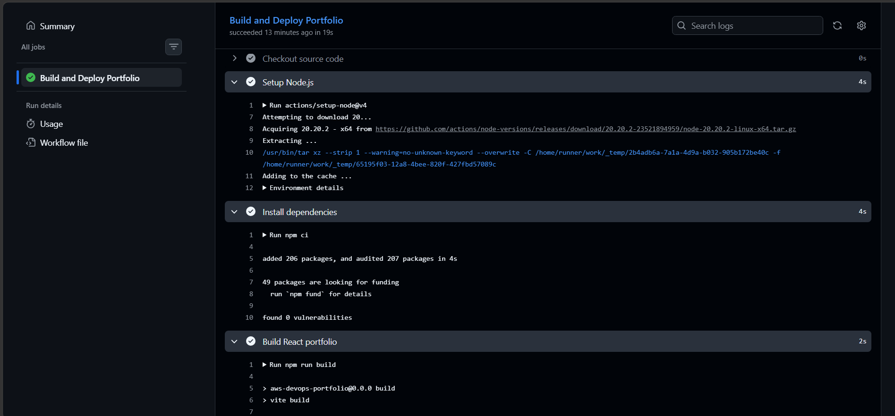
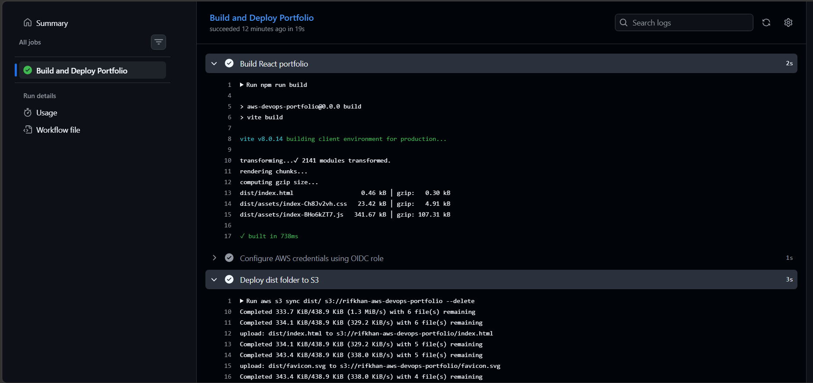
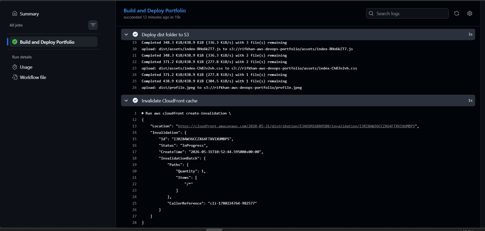

### S3 Bucket Deployment

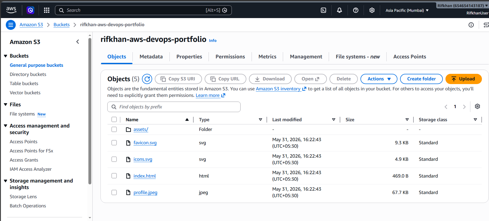

### CloudFront Distribution

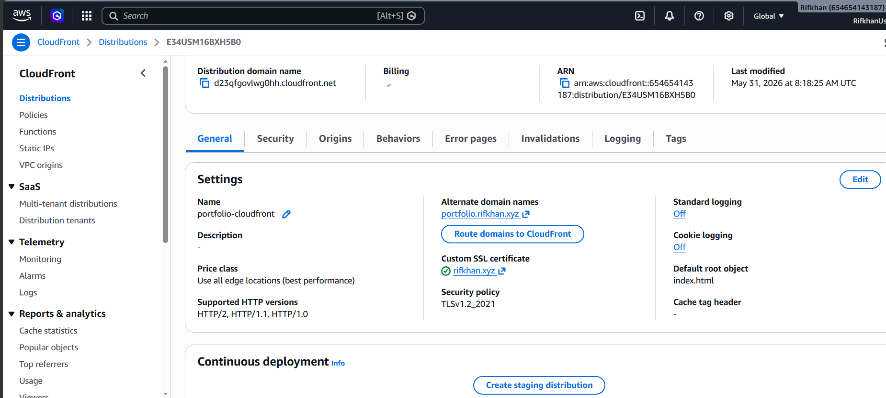
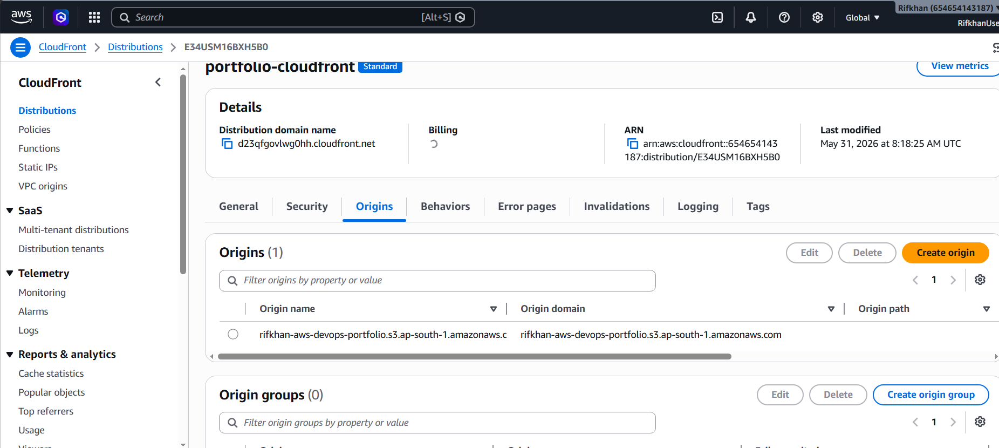
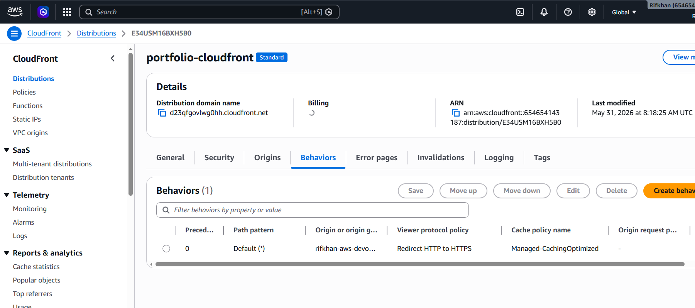
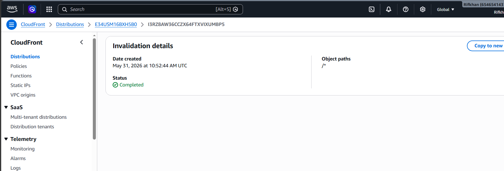

### Route 53 Domain

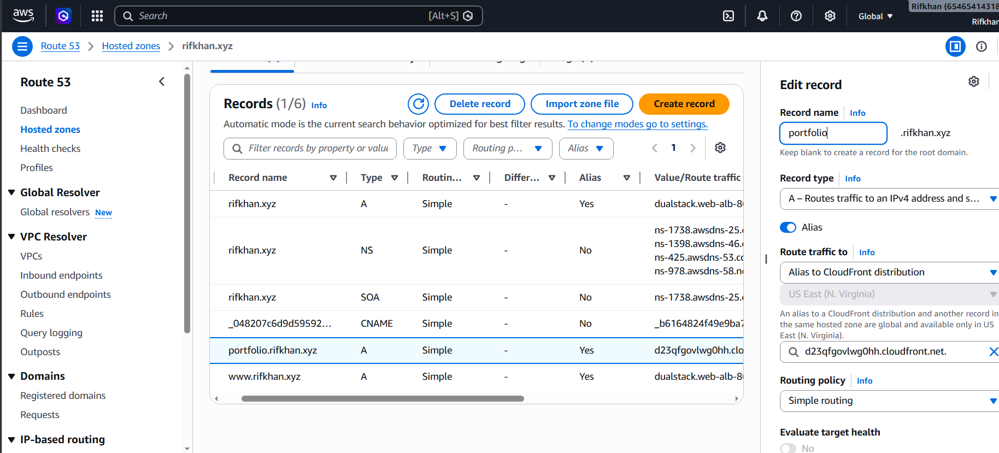

## What I Learned

Through this project, I practiced:

- Building and deploying a React application
- Hosting static websites on Amazon S3
- Using CloudFront as a CDN
- Enabling HTTPS with AWS Certificate Manager
- Connecting a custom domain using Route 53
- Automating deployment using GitHub Actions
- Using GitHub Actions OIDC for secure AWS authentication
- Applying least-privilege IAM permissions
- Invalidating CloudFront cache after deployment
- Creating a production-style cloud deployment workflow

## Skills Demonstrated

- AWS S3 Static Website Hosting
- CloudFront CDN
- ACM SSL/TLS Certificate
- Route 53 DNS Management
- IAM Role and Policy Configuration
- GitHub Actions CI/CD
- OIDC Authentication
- React Frontend Development
- Tailwind CSS Styling
- Production Build Deployment
- CloudFront Cache Invalidation
- DevOps Automation

## Future Improvements

- Add Terraform automation for S3, CloudFront, ACM, Route 53, and IAM
- Add monitoring using CloudWatch
- Add custom error pages
- Add performance optimization
- Add automated security checks in CI/CD
- Add Lighthouse performance report
- Add resume download button
- Add blog section for AWS learning notes

## Author

Mohammed Rifkhan

AWS Certified Solutions Architect Associate
Junior Cloud & DevOps Engineer
Full-Stack Developer
